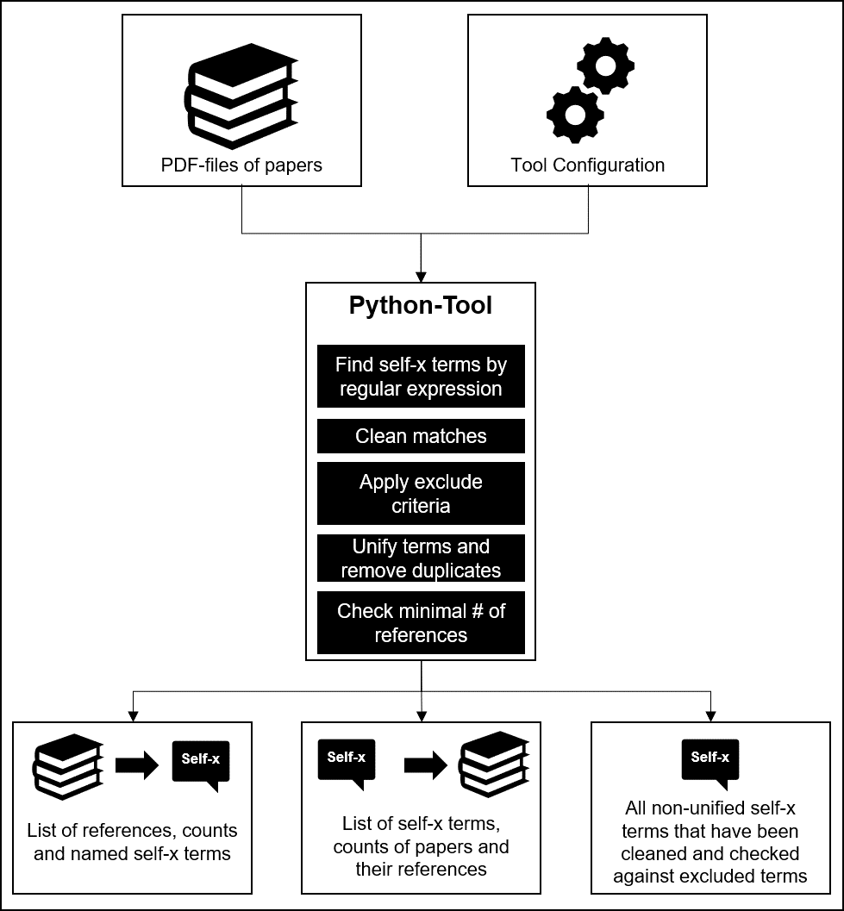

# Extract Self-X Terms from Papers

This tool has been created to support research on self-x terms in the field of autonomous systems. It is supposed to automatize the exploration of self-x terms in a selection of papers to allow an in-depth analysis of common self-x terms, their references and meaning for system autonomy. 

It has been part of a research project that is related to the characterization of autonomous systems and similar system classes. Thereby this tool has been published to allow a validation of research results, but it can also be used by others to extract self-x or other terms from a bunch of papers.

## Table of contents
- [Extract Self-X Terms from Papers](#extract-self-x-terms-from-papers)
  - [Table of contents](#table-of-contents)
  - [Overview](#overview)
    - [Input Files](#input-files)
      - [Configuration](#configuration)
      - [Papers](#papers)
    - [Process Steps](#process-steps)
      - [1) Find self-x terms by regular expression](#1-find-self-x-terms-by-regular-expression)
      - [2) Clean matches](#2-clean-matches)
      - [3) Apply exclusion criteria](#3-apply-exclusion-criteria)
      - [4) Unify terms](#4-unify-terms)
      - [5) Check minimal number of references](#5-check-minimal-number-of-references)
    - [Output Files](#output-files)
  - [Use Tool](#use-tool)
    - [Environment](#environment)
    - [Execute Tool](#execute-tool)
    - [Issues \& Logs](#issues--logs)


## Overview

The idea of the tool is to extract self-x terms from a bunch of papers. Thereby the tool iterates over [provided papers](#input-files), [applys a number of process steps](#process-steps) and creates a bunch of [output files](#output-files) for further analysis. The user can influence the tool behaviour using a [configuration file](/config.example.ini).




### Input Files

The tool relys on a set of input files that are mandatory for a successful tool exection (see [Configuration](#configuration) and [Papers](#papers)).

#### Configuration

The user can influence the tool behaviour based on a configuration file called *config.ini* in root folder of the project. Thereby the user can define certain properties for input files (section *inputfiles*), output files (section *outputfiles*) and term processing in general (section *parse*). 

Each property is documented with comments in [configuration-file](/config.example.ini) and explained in the further course of this readme.

#### Papers

As the goal of the tool is to extract self-x terms from papers, the tool relys on a bunch of papers. 

Thereby, the papers have to be organized into subfolders that structure the files into specific subtopics. As an example there could be the subfolders *Autonomous Systems*, *Complex Systems*, *Cyber-physical-Systems* that include the pdf files of the papers. All subfolders that should be included in parsing process, have to be configured in configuration (*relevant_folders*). 

Moreover a specific root folder for example *C:\\path\\to\\repo\\extract_selfx\\papers* that contains the subfolders has to be created and configured as well (*rootdir_papers*). 

Following the example a folder structure like that can be used:
```
- papers <-- root folder of papers here C:\path\to\repo\extract_selfx\papers
    - Autonomous Systems <-- subfolder 1
        - Paper1.pdf <-- papers
        - Paper2.pdf
        - Paper3.pdf
    - Complex Systems <-- subfolder 2
        - Paper1.pdf
    - Cyber-physical-Systems <-- subfolder 3
        - Paper1.pdf
        - Paper2.pdf
```

### Process Steps

As explained in the overview section the tool has a parsing process that can be broken into some building blocks:
1. Find self-x terms by regular expression ([see](#1-find-self-x-terms-by-regular-expression))
2. Clean matches ([see](#2-clean-matches))
3. Apply exclusion criteria ([see](#3-apply-exclusion-criteria))
4. Unify terms ([see](#4-unify-terms))
5. Check minimal number of references ([see](#5-check-minimal-number-of-references))


#### 1) Find self-x terms by regular expression

The tool will sequentielly loop through all configured subfolders and parse each pdf file one by one. Thereby, the text of each page will be extracted and matched agains following regular expression:
```
# search self-x in page via regex
# -> Upper / Lowercase will be ignored
# -> self-term can have spaces between "-" because of pdf-parsing with library PyPDF2 and ocr issues in pdf
# -> a self-term could be broken into two line using "-\n"
search_term = r'(self {0,1}\- {0,1}[A-Za-z]+|self {0,1}\- {0,1}\n {0,1}[A-Za-z]+)'
matches_search = re.findall(search_term, text, re.IGNORECASE)
```

*This regex can be used to parse self-x terms from papers. In case you want to use a different regex you can change this line of code according to your own needs.*

#### 2) Clean matches

As terms can be splitted accorss lines and the text can not be perfectly parsed from pdf, there are some unwanted characters, mixed usage of upper- and lowercase and linebreaks. 

These will be cleaned by the tool for each match:
```
# transform to lowercase and remove \n and space
cleaned_match = ''.join(match.lower().replace(" ", "").splitlines())
```

#### 3) Apply exclusion criteria

Next there are unwanted terms. These can be:
1. **Excluded self-x terms**: There are some terms that should not be included in the collection of the tool. These can be for example general terms such as *self-x*, *self-chop* or *self-properties* that are no specific self-x characteristics. Use configuration property *excluded_selfx* to create a list of self-x-terms that should not be included.
2. **Terms with not allowed endings**: As an addition to 1) terms can also be excluded by ending, so that unwanted words can be excluded without naming each term explicitly. These could be for example *software*, *device* or *material* so that the terms *self-software*, *self-device* and *self-material* will be ignored. Use configuration property *excluded_endings* to create a list of not allowed endings.
3. **Too long words**: Sometimes spaces are not parsed correctly from pdf with the result that a term can include the next word or a whole line. To remove wrongly parsed elements, a maximum self-x term size can be configured by specifying the allowed number of characters using property *max_length_term* (default 20).

#### 4) Unify terms

Self-x terms are used in different contexts and sentence structure and therefore occur in different word forms such as nouns, verbs or adjectives. For a better comparison of named terms, the tool allows to unify common word terms by specifying a regex (*unify_words_regex*) and a related unified term (*unify_words_replacement*). For example the regex *self\\-opti[A-Za-z]** (simple form: *self-opti**) can be used to replace words such as *self-optimising*, *self-optimisation* or *self-optimizing* with the configured unified form *self-optimization*. 

#### 5) Check minimal number of references

To exclude uncommon terms that have only been named by single or only a few authors, a minimal number of references can be defined. This number specifies how many papers need to name a self-x term, so that this term is included in output file *output_selfx*. By specifying for example 2 the self-x term has to be named by at least two papers.

### Output Files

The tool produces three different output-files:
1. **Self-X terms => Papers:** This output file contains a list of all self-x terms, the amount of papers which named them and the related filenames. Its name can be configured with property *output_selfx*.
2. **Papers => Self-X terms:** This output file contains a list of all papers with matches, the number of self-x terms used and lists the self-x terms which have been found in this paper. The name of the output file can be configured with property *output_paper*.
3. **Raw results:** All matches of the regular expression will be exported to output file that has been configured in *output_raw*. It contains matches that have been extracted from pdf, cleaned and checked against exclude critera. In contrast to the other files the terms haven't been unified and include duplicates, so that a user can use this file to optimize parameters *unify_words_regex* and *unify_words_replacement* for unification. Moreover the length of each term has been calculated to support fine-tuning parameter *max_length_term* (maximum allowed length). 


You can define a root folder for output files by specifying *rootdir_output* in configuration. This will be the place where the output of the tool will be stored.


## Use Tool

### Environment

To run the tool you will need a Python environment. The tool has been developed and tested on Windows OS with Python 3.10.4. It is possible that the tool also supports other Python versions, but it has not been tested with them.

### Execute Tool
To run the tool you need to:
1. Install Python packages from [requirements.txt](/) bare-metal or into a virtual environment: ```pip install -r requirements.txt```
2. Create configuration *config.ini* based on example configuration in [config.example.ini](/config.example.ini) with your own configuration
3. Place papers you like to parse into configured input folder
4. Run the file [parse_pdf.py](/parse_pdf.py): ```py -m parse_pdf```
5. Find the results in configured output-folder


### Issues & Logs

The tool logs all steps and errors in command line and in log file selfx.log in the root folder of the project.

Moreover the tool won't be able to parse all types of PDFs correctly what results in some unwanted matches. A manual review of the list is therefore highly recommended.